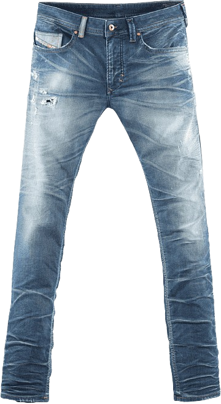

# Parte_2
## _Ecommer campus_

En este documento encontraras informacion sobre la realizacion de mi pagina web.

- Introducción
- ✨Variables✨
- Video de explicación en las dos vistas, monitor y celular
- Código HTML
- Código CSS


## Introducción

Rama de repositorio creada para la realizacion de una pagina web de tienda de ropa donde utilizo colores a mi gusto pero sin salir de lo estetico y sigo en mayor parte el estilo pedido para la realizacion de esta pagina además siendo responsive tanto para celular como computadoras 

## Vistas

#### Monitor:

https://youtu.be/L7wqChQ0HTs

#### Celular:

https://youtube.com/shorts/c7Sx-Wit1UA?feature=share

## Variables

Estas son las variables y/o colores usados en esta pagian web

| Nombre | Color |
| ------ | ------ |
| primario | #651A1A |
| secundario | #8B8484 |
| terciario | #3B3535|
| cuarto | #4D2F2F|
| quinto | #573232 |
| sexto | rgba(255, 255, 255, 0.562) |

## HTML
Puesto que son varios HTML solo dejare los nombres usados en cada html y el codigo del principal el cual es el index.html
- index.html
- abrigos.html
- camisetas.html
- carrito.html
- eliminar.html
- pantalones.html
- vacias.html

#### Index.html
```html
<!DOCTYPE html>
<html lang="en">

<head>
  <meta charset="UTF-8" />
  <meta name="viewport" content="width=device-width, initial-scale=1.0" />
  <title>Parte_2</title>
  <link rel="stylesheet" href="css/styles.css" />
  <link href="https://unpkg.com/boxicons@2.1.4/css/boxicons.min.css" rel="stylesheet" />
</head>

<body>
  <div class="div1">
    <h1 class="div1_h1">CampusShop</h1>
    <br>
    <button id="toggleMenu">Menu</button>
  </div>
  <div class="div2">
    <nav id="menu">
      <ul class="div2_ul">
        <li class="div2_ul_li_eleccion">
          <a href="index.html"><i class="bx bx-menu-alt-left" style="color: var(--color-primario);"></i></a>
          <p class="div2_ul_li_p">Todos los productos</p>
        </li>
        <li class="div2_ul_li">
          <a href="views/abrigos.html"><i class="bx bx-chevrons-left" style="color: var(--color-primario);"></i></a>
          <p class="div2_ul_li_p">Abrigos</p>
        </li>
        <li class="div2_ul_li">
          <a href="views/camisetas.html"><i class="bx bx-chevrons-left" style="color: var(--color-primario);"></i></a>
          <p class="div2_ul_li_p">Camisetas</p>
        </li>
        <li class="div2_ul_li">
          <a href="views/pantalones.html"><i class="bx bx-chevrons-left" style="color: var(--color-primario);"></i></a>
          <p class="div2_ul_li_p">Pantalones</p>
        </li>
      </ul>
    </nav>
  </div>
  <div class="div3">
    <div class="div3_1">
      <a href="views/carrito.html"><i class="bx bxs-cart" style="color: var(--color-primario);"></i></a>
      <p class="div3_p">Carritos</p>
      <div class="div3_1_3">3</div>
    </div>
  </div>
  <div class="div4">
    <p class="div4_p">© 2023 Camper</p>
  </div>
  <div class="div5">
    <p class="div5_p">Todos los productos</p>
    <div class="div5_contenedor">
      <div class="div5_1">
        
        <div class="div5_1_1">
          <p class="div5_1_1_p">
            Abrigo 01 <br />
            $ 1.000
          </p>
          <div class="button">
            <div class="button-wrapper">
              <div class="text">Agregar</div>
              <span class="icon">
                <svg xmlns="http://www.w3.org/2000/svg" width="16" height="16" fill="currentColor" class="bi bi-cart2"
                  viewBox="0 0 16 16">
                  <path
                    d="M0 2.5A.5.5 0 0 1 .5 2H2a.5.5 0 0 1 .485.379L2.89 4H14.5a.5.5 0 0 1 .485.621l-1.5 6A.5.5 0 0 1 13 11H4a.5.5 0 0 1-.485-.379L1.61 3H.5a.5.5 0 0 1-.5-.5zM3.14 5l1.25 5h8.22l1.25-5H3.14zM5 13a1 1 0 1 0 0 2 1 1 0 0 0 0-2zm-2 1a2 2 0 1 1 4 0 2 2 0 0 1-4 0zm9-1a1 1 0 1 0 0 2 1 1 0 0 0 0-2zm-2 1a2 2 0 1 1 4 0 2 2 0 0 1-4 0z">
                  </path>
                </svg>
              </span>
            </div>
          </div>
        </div>
      </div>
      <div class="div5_1">
        
        <div class="div5_1_1">
          <p class="div5_1_1_p">
            Abrigo 02 <br />
            $ 2.000
          </p>
          <div class="button">
            <div class="button-wrapper">
              <div class="text">Agregar</div>
              <span class="icon">
                <svg xmlns="http://www.w3.org/2000/svg" width="16" height="16" fill="currentColor" class="bi bi-cart2"
                  viewBox="0 0 16 16">
                  <path
                    d="M0 2.5A.5.5 0 0 1 .5 2H2a.5.5 0 0 1 .485.379L2.89 4H14.5a.5.5 0 0 1 .485.621l-1.5 6A.5.5 0 0 1 13 11H4a.5.5 0 0 1-.485-.379L1.61 3H.5a.5.5 0 0 1-.5-.5zM3.14 5l1.25 5h8.22l1.25-5H3.14zM5 13a1 1 0 1 0 0 2 1 1 0 0 0 0-2zm-2 1a2 2 0 1 1 4 0 2 2 0 0 1-4 0zm9-1a1 1 0 1 0 0 2 1 1 0 0 0 0-2zm-2 1a2 2 0 1 1 4 0 2 2 0 0 1-4 0z">
                  </path>
                </svg>
              </span>
            </div>
          </div>
        </div>
      </div>
      <div class="div5_1">
        
        <div class="div5_1_1">
          <p class="div5_1_1_p">
            Camisetas 01 <br />
            $ 2.500
          </p>
          <div class="button">
            <div class="button-wrapper">
              <div class="text">Agregar</div>
              <span class="icon">
                <svg xmlns="http://www.w3.org/2000/svg" width="16" height="16" fill="currentColor" class="bi bi-cart2"
                  viewBox="0 0 16 16">
                  <path
                    d="M0 2.5A.5.5 0 0 1 .5 2H2a.5.5 0 0 1 .485.379L2.89 4H14.5a.5.5 0 0 1 .485.621l-1.5 6A.5.5 0 0 1 13 11H4a.5.5 0 0 1-.485-.379L1.61 3H.5a.5.5 0 0 1-.5-.5zM3.14 5l1.25 5h8.22l1.25-5H3.14zM5 13a1 1 0 1 0 0 2 1 1 0 0 0 0-2zm-2 1a2 2 0 1 1 4 0 2 2 0 0 1-4 0zm9-1a1 1 0 1 0 0 2 1 1 0 0 0 0-2zm-2 1a2 2 0 1 1 4 0 2 2 0 0 1-4 0z">
                  </path>
                </svg>
              </span>
            </div>
          </div>
        </div>
      </div>
      <div class="div5_1">
        
        <div class="div5_1_1">
          <p class="div5_1_1_p">
            Camisetas 02 <br />
            $ 2.000
          </p>
          <div class="button">
            <div class="button-wrapper">
              <div class="text">Agregar</div>
              <span class="icon">
                <svg xmlns="http://www.w3.org/2000/svg" width="16" height="16" fill="currentColor" class="bi bi-cart2"
                  viewBox="0 0 16 16">
                  <path
                    d="M0 2.5A.5.5 0 0 1 .5 2H2a.5.5 0 0 1 .485.379L2.89 4H14.5a.5.5 0 0 1 .485.621l-1.5 6A.5.5 0 0 1 13 11H4a.5.5 0 0 1-.485-.379L1.61 3H.5a.5.5 0 0 1-.5-.5zM3.14 5l1.25 5h8.22l1.25-5H3.14zM5 13a1 1 0 1 0 0 2 1 1 0 0 0 0-2zm-2 1a2 2 0 1 1 4 0 2 2 0 0 1-4 0zm9-1a1 1 0 1 0 0 2 1 1 0 0 0 0-2zm-2 1a2 2 0 1 1 4 0 2 2 0 0 1-4 0z">
                  </path>
                </svg>
              </span>
            </div>
          </div>
        </div>
      </div>
      <div class="div5_1">
        
        <div class="div5_1_1">
          <p class="div5_1_1_p">
            Pantalones 01 <br />
            $ 2.000
          </p>
          <div class="button">
            <div class="button-wrapper">
              <div class="text">Agregar</div>
              <span class="icon">
                <svg xmlns="http://www.w3.org/2000/svg" width="16" height="16" fill="currentColor" class="bi bi-cart2"
                  viewBox="0 0 16 16">
                  <path
                    d="M0 2.5A.5.5 0 0 1 .5 2H2a.5.5 0 0 1 .485.379L2.89 4H14.5a.5.5 0 0 1 .485.621l-1.5 6A.5.5 0 0 1 13 11H4a.5.5 0 0 1-.485-.379L1.61 3H.5a.5.5 0 0 1-.5-.5zM3.14 5l1.25 5h8.22l1.25-5H3.14zM5 13a1 1 0 1 0 0 2 1 1 0 0 0 0-2zm-2 1a2 2 0 1 1 4 0 2 2 0 0 1-4 0zm9-1a1 1 0 1 0 0 2 1 1 0 0 0 0-2zm-2 1a2 2 0 1 1 4 0 2 2 0 0 1-4 0z">
                  </path>
                </svg>
              </span>
            </div>
          </div>
        </div>
      </div>
      <div class="div5_1">
        
        <div class="div5_1_1">
          <p class="div5_1_1_p">
            Pantalones 02 <br />
            $ 2.500
          </p>
          <div class="button">
            <div class="button-wrapper">
              <div class="text">Agregar</div>
              <span class="icon">
                <svg xmlns="http://www.w3.org/2000/svg" width="16" height="16" fill="currentColor" class="bi bi-cart2"
                  viewBox="0 0 16 16">
                  <path
                    d="M0 2.5A.5.5 0 0 1 .5 2H2a.5.5 0 0 1 .485.379L2.89 4H14.5a.5.5 0 0 1 .485.621l-1.5 6A.5.5 0 0 1 13 11H4a.5.5 0 0 1-.485-.379L1.61 3H.5a.5.5 0 0 1-.5-.5zM3.14 5l1.25 5h8.22l1.25-5H3.14zM5 13a1 1 0 1 0 0 2 1 1 0 0 0 0-2zm-2 1a2 2 0 1 1 4 0 2 2 0 0 1-4 0zm9-1a1 1 0 1 0 0 2 1 1 0 0 0 0-2zm-2 1a2 2 0 1 1 4 0 2 2 0 0 1-4 0z">
                  </path>
                </svg>
              </span>
            </div>
          </div>
        </div>
      </div>
      <div class="div5_1">
        
        <div class="div5_1_1">
          <p class="div5_1_1_p">
            Pantalones 03 <br />
            $ 1.000
          </p>
          <div class="button">
            <div class="button-wrapper">
              <div class="text">Agregar</div>
              <span class="icon">
                <svg xmlns="http://www.w3.org/2000/svg" width="16" height="16" fill="currentColor" class="bi bi-cart2"
                  viewBox="0 0 16 16">
                  <path
                    d="M0 2.5A.5.5 0 0 1 .5 2H2a.5.5 0 0 1 .485.379L2.89 4H14.5a.5.5 0 0 1 .485.621l-1.5 6A.5.5 0 0 1 13 11H4a.5.5 0 0 1-.485-.379L1.61 3H.5a.5.5 0 0 1-.5-.5zM3.14 5l1.25 5h8.22l1.25-5H3.14zM5 13a1 1 0 1 0 0 2 1 1 0 0 0 0-2zm-2 1a2 2 0 1 1 4 0 2 2 0 0 1-4 0zm9-1a1 1 0 1 0 0 2 1 1 0 0 0 0-2zm-2 1a2 2 0 1 1 4 0 2 2 0 0 1-4 0z">
                  </path>
                </svg>
              </span>
            </div>
          </div>
        </div>
      </div>
      <div class="div5_1">
        
        <div class="div5_1_1">
          <p class="div5_1_1_p">
            Pantalones 04 <br />
            $ 2.000
          </p>
          <div class="button">
            <div class="button-wrapper">
              <div class="text">Agregar</div>
              <span class="icon">
                <svg xmlns="http://www.w3.org/2000/svg" width="16" height="16" fill="currentColor" class="bi bi-cart2"
                  viewBox="0 0 16 16">
                  <path
                    d="M0 2.5A.5.5 0 0 1 .5 2H2a.5.5 0 0 1 .485.379L2.89 4H14.5a.5.5 0 0 1 .485.621l-1.5 6A.5.5 0 0 1 13 11H4a.5.5 0 0 1-.485-.379L1.61 3H.5a.5.5 0 0 1-.5-.5zM3.14 5l1.25 5h8.22l1.25-5H3.14zM5 13a1 1 0 1 0 0 2 1 1 0 0 0 0-2zm-2 1a2 2 0 1 1 4 0 2 2 0 0 1-4 0zm9-1a1 1 0 1 0 0 2 1 1 0 0 0 0-2zm-2 1a2 2 0 1 1 4 0 2 2 0 0 1-4 0z">
                  </path>
                </svg>
              </span>
            </div>
          </div>
        </div>
      </div>
      <div class="div5_1">
        
        <div class="div5_1_1">
          <p class="div5_1_1_p">
            Pantalones 05 <br />
            $ 1.500
          </p>
          <div class="button">
            <div class="button-wrapper">
              <div class="text">Agregar</div>
              <span class="icon">
                <svg xmlns="http://www.w3.org/2000/svg" width="16" height="16" fill="currentColor" class="bi bi-cart2"
                  viewBox="0 0 16 16">
                  <path
                    d="M0 2.5A.5.5 0 0 1 .5 2H2a.5.5 0 0 1 .485.379L2.89 4H14.5a.5.5 0 0 1 .485.621l-1.5 6A.5.5 0 0 1 13 11H4a.5.5 0 0 1-.485-.379L1.61 3H.5a.5.5 0 0 1-.5-.5zM3.14 5l1.25 5h8.22l1.25-5H3.14zM5 13a1 1 0 1 0 0 2 1 1 0 0 0 0-2zm-2 1a2 2 0 1 1 4 0 2 2 0 0 1-4 0zm9-1a1 1 0 1 0 0 2 1 1 0 0 0 0-2zm-2 1a2 2 0 1 1 4 0 2 2 0 0 1-4 0z">
                  </path>
                </svg>
              </span>
            </div>
          </div>
        </div>
      </div>
      <div class="div5_1">
        
        <div class="div5_1_1">
          <p class="div5_1_1_p">
            Abrigo 03 <br />
            $ 2.500
          </p>
          <div class="button">
            <div class="button-wrapper">
              <div class="text">Agregar</div>
              <span class="icon">
                <svg xmlns="http://www.w3.org/2000/svg" width="16" height="16" fill="currentColor" class="bi bi-cart2"
                  viewBox="0 0 16 16">
                  <path
                    d="M0 2.5A.5.5 0 0 1 .5 2H2a.5.5 0 0 1 .485.379L2.89 4H14.5a.5.5 0 0 1 .485.621l-1.5 6A.5.5 0 0 1 13 11H4a.5.5 0 0 1-.485-.379L1.61 3H.5a.5.5 0 0 1-.5-.5zM3.14 5l1.25 5h8.22l1.25-5H3.14zM5 13a1 1 0 1 0 0 2 1 1 0 0 0 0-2zm-2 1a2 2 0 1 1 4 0 2 2 0 0 1-4 0zm9-1a1 1 0 1 0 0 2 1 1 0 0 0 0-2zm-2 1a2 2 0 1 1 4 0 2 2 0 0 1-4 0z">
                  </path>
                </svg>
              </span>
            </div>
          </div>
        </div>
      </div>
      <div class="div5_1">
        
        <div class="div5_1_1">
          <p class="div5_1_1_p">
            Abrigo 04 <br />
            $ 3.000
          </p>
          <div class="button">
            <div class="button-wrapper">
              <div class="text">Agregar</div>
              <span class="icon">
                <svg xmlns="http://www.w3.org/2000/svg" width="16" height="16" fill="currentColor" class="bi bi-cart2"
                  viewBox="0 0 16 16">
                  <path
                    d="M0 2.5A.5.5 0 0 1 .5 2H2a.5.5 0 0 1 .485.379L2.89 4H14.5a.5.5 0 0 1 .485.621l-1.5 6A.5.5 0 0 1 13 11H4a.5.5 0 0 1-.485-.379L1.61 3H.5a.5.5 0 0 1-.5-.5zM3.14 5l1.25 5h8.22l1.25-5H3.14zM5 13a1 1 0 1 0 0 2 1 1 0 0 0 0-2zm-2 1a2 2 0 1 1 4 0 2 2 0 0 1-4 0zm9-1a1 1 0 1 0 0 2 1 1 0 0 0 0-2zm-2 1a2 2 0 1 1 4 0 2 2 0 0 1-4 0z">
                  </path>
                </svg>
              </span>
            </div>
          </div>
        </div>
      </div>
      <div class="div5_1">
        
        <div class="div5_1_1">
          <p class="div5_1_1_p">
            Abrigo 05 <br />
            $ 3.500
          </p>
          <div class="button">
            <div class="button-wrapper">
              <div class="text">Agregar</div>
              <span class="icon">
                <svg xmlns="http://www.w3.org/2000/svg" width="16" height="16" fill="currentColor" class="bi bi-cart2"
                  viewBox="0 0 16 16">
                  <path
                    d="M0 2.5A.5.5 0 0 1 .5 2H2a.5.5 0 0 1 .485.379L2.89 4H14.5a.5.5 0 0 1 .485.621l-1.5 6A.5.5 0 0 1 13 11H4a.5.5 0 0 1-.485-.379L1.61 3H.5a.5.5 0 0 1-.5-.5zM3.14 5l1.25 5h8.22l1.25-5H3.14zM5 13a1 1 0 1 0 0 2 1 1 0 0 0 0-2zm-2 1a2 2 0 1 1 4 0 2 2 0 0 1-4 0zm9-1a1 1 0 1 0 0 2 1 1 0 0 0 0-2zm-2 1a2 2 0 1 1 4 0 2 2 0 0 1-4 0z">
                  </path>
                </svg>
              </span>
            </div>
          </div>
        </div>
      </div>
    </div>
  </div>
<script>
  const toggleMenuButton = document.getElementById('toggleMenu');
  const menuDiv2 = document.querySelector('.div2 nav');

  toggleMenuButton.addEventListener('click', function() {
    if (menuDiv2.style.display === 'none') {
      menuDiv2.style.display = 'block';
    } else {
      menuDiv2.style.display = 'none';
    }
  });
</script>
</body>

</html>
```

## CSS
Al ser varios CSS solo dejare los nombres usados en cada uno y el codigo del principal el cual es style.css
- carrito.css
- productos.css
- styles.css
- variables.css

#### styles.css
```css
@import url(variables.css);

* {
  margin: 0;
  padding: 0;
  box-sizing: border-box;
}
body {
  width: 100%;
  height: 100vh;
  padding: 2em 2em 2em 2em;
  background: var(--color-secundario);
  color: var(--color-primario);
  font-family: Verdana, Geneva, Tahoma, sans-serif;
  display: grid;
  grid-template-columns: 1fr 4fr;
  grid-template-rows: repeat(6, 1fr);
  grid-template-areas:
    "logo img"
    "menus img"
    "menus img"
    ". img"
    "carrito img"
    "derechos img";
}
.div1 {
  grid-area: logo;
  /* background: red; */
}
.div1_h1 {
  font-size: 2.5em;
  /* background: pink; */
}
#toggleMenu{
  display: none;
}
.div2 {
  grid-area: menus;
  /* background: blue; */
}
.div2_ul{
    height: 100%;
    font-size: 1.5em;
    /* background: red; */
    display: flex;
    flex-direction: column;
    gap: 2em;
}
.div2_ul_li_eleccion,
.div2_ul_li{
    /* background: yellow; */
    list-style-type: none;
    gap: 1.5em;
    display: flex;
    align-items: center;
}
.div2_ul_li_eleccion{
    background: var(--color-sexto);
    /* border: 1px solid var(--color-primario); */
    border-right: 0px;
}
.bx-menu-alt-left{
    font-size: 1.5em;
}
.bx-chevrons-left{
    font-size: 1.5em;
}
.div3 {
  grid-area: carrito;
  /* background: yellow; */
}
.div3_1 {
  width: 100%;
  height: 30%;
  /* background: red; */
  font-size: 1.5em;
  display: flex;
  flex-direction: row;
  align-items: center;
  gap: 1.5em;
}
.bxs-cart{
    font-size: 1.5em;
}
.div3_1_3 {
  background: var(--color-sexto);
  width: 8%;
  border: 3px solid var(--color-primario);
  border-radius: 5px;
  display: flex;
  justify-content: center;
  align-items: center;
}
.div4 {
  grid-area: derechos;
  /* background: red; */
}
.div4_p {
  font-size: 1.5em;
}
.div5 {
    width: 100%;
    height: 95vh;
    grid-area: img;
    background: var(--color-sexto);
    border-radius: 3em;
    /* border: 1px solid var(--color-primario); */
    -webkit-box-shadow: inset -47px -57px 47px -42px rgba(0,0,0,1);
-moz-box-shadow: inset -47px -57px 47px -42px rgba(0,0,0,1);
box-shadow: inset -47px -57px 47px -42px rgba(0,0,0,1);
}
.div5_p{
    width: 100%;
    height: 10vh;
    /* background: blue; */
    font-size: 3em;
    padding: .5em 0 1.5em .5em;
    display: flex;
}
.div5_contenedor{
    width: 100%;
    height: 95%;
    padding: 0 0 0 1.5em;
    /* background: red; */
    display: flex;
    flex-direction: row;
    flex-wrap: wrap;
    gap: 1.8em;
    max-height: 80vh;
    overflow-y: scroll;
}
.div5_1 {
    width: 23%;
    height: 48%;
    background: linear-gradient(#0001, var(--color-primario));
    -webkit-box-shadow: inset -47px -57px 47px -42px rgba(0,0,0,1);
-moz-box-shadow: inset -47px -57px 47px -42px rgba(0,0,0,1);
box-shadow: inset -47px -57px 47px -42px rgba(0,0,0,1);
    display: flex;
    flex-direction: column;
    align-items: center;
    border-radius: 20px; 
    overflow: hidden; 
}
.div5_1 img{
    width: 100%;
    height: 70%;
    
    /* background: red; */
}
.div5_1_1{
    width: 100%;
    height: 30%;
    background: var(--color-secundario);
    border-radius: 1.5em;
    border: 2px solid var(--color-quinto);
    display: flex;
    align-items: center;
    justify-content: flex-start;
}
.div5_1_1_p{
    width: 55%;
    height: 100%;
    display: flex;
    align-items: center;
    font-size: 1.2em;
    margin-left: 1em;
    line-height: 2em; 
    /* background: red; */
}
.button {
  --width: 100px;
  --height: 35px;
  margin: 4em 1em 1em .5em;
  --tooltip-height: 35px;
  --tooltip-width: 90px;
  --gap-between-tooltip-to-button: 18px;
  --button-color: #222;
  --tooltip-color: #fff;
  width: var(--width);
  height: var(--height);
  background: green;
  position: relative;
  text-align: center;
  border-radius: 0.5em;
  font-family: "Arial";
  transition: background 0.7s;
}
.text {
  display: flex;
  align-items: center;
  justify-content: center;
}
.button-wrapper,
.text,
.icon {
  overflow: hidden;
  position: absolute;
  width: 100%;
  height: 100%;
  left: 0;
  color: #fff;
}
.text {
  top: 0;
}
.text,
.icon {
  transition: top 0.5s;
}
.icon {
  color: #fff;
  top: 100%;
  display: flex;
  align-items: center;
  justify-content: center;
}
.icon svg {
  width: 24px;
  height: 24px;
}
.button:hover {
  cursor: pointer;
}
.button:hover .text {
  top: -100%;
}
.button:hover .icon {
  top: 0;
}

@media only screen and (max-width: 800px) {
  body {
    padding: 0.5em 0.5em 0.5em 0.5em;
    grid-template-columns: 1fr;
    grid-template-areas:
      "logo"
      "menus"
      "carrito"
      "img"
      "derechos";
  }
  .div2 nav{
    display: none;
    background: var(--color-sexto);
    border: 1px solid var(--color-terciario);
  }
  #toggleMenu{
    display: block;
    font-size: 1.5em;
    width: 3em;
    background: var(--color-sexto);
  }
  .div2_ul {
    padding-top: 1em;
    gap: 0em;
    margin-top: -1em;
  }
  .div2_ul_li_eleccion,
  .div2_ul_li{
    border: 1px solid var(--color-terciario);
  }
  .div2_ul_li_eleccion{
    background: none;
  }
  .div3_1 {
    background: none;
    padding-top: 2em;
  }
  .div4_p {
    padding-top: 2em;
  }
  .div5 {
    width: 95vw;
    height: 100vh;
    margin-top: 0.5em;
    padding: 0em 0em;
    /* background: blue; */
  }
  .div5_p{
    font-size: 1.5em;
    padding: 1em 0 1.5em 1em;
    display: flex;
    }
  .div5_contenedor {
    height: 100%;
    padding: 0 0 0 1em;
    gap: 1em;
    max-height: 75vh;
    overflow: scroll;
    /* background: blue; */
  }
  .div5_1 {
    width: 45%;
    height: 35vh;
    gap: 0.2em;
  }
  .div5_1 img {
    width: 50%;
    height: 30vh;
  }
  .div5_1_1 {
    width: 100%;
    font-size: 0.5em;
    display: flex;
    align-items: center;
    line-height: 1.5em;
  }
  .div5_1_1_p{
    width: 55%;
    height: 100%;
    display: flex;
    align-items: center;
    font-size: 1em;
    margin-left: 1em;
    line-height: 2em; 
    /* background: red; */
  }
  .button {
    --width: 80px;
    --height: 20px;
  }
  .icon svg {
    width: 14px;
    height: 14px;
  }
}
```

> Hecho por `Camilo Andres Navas Medina`.

